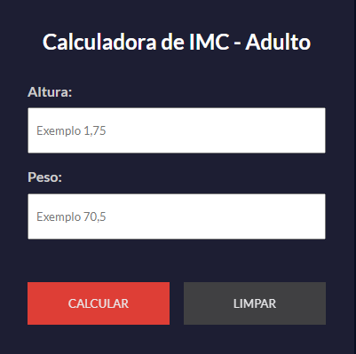
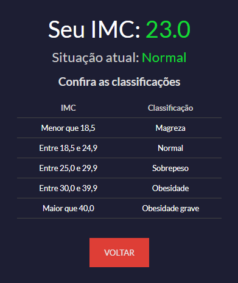
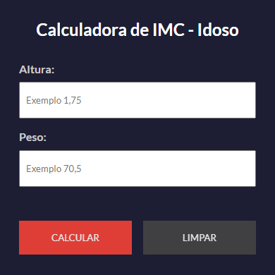
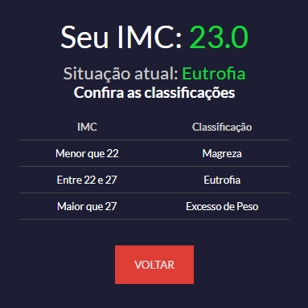

<h1 align="center">🖩 Calculadoras de IMC para Adulto e Idoso 🖩</h1>

<h2 align="center">Adultos</h2>
  
<h3 align="center"> Ao incluir os dados (altura e peso), é informado o IMC do usuário es classificações de IMC para indivíduos adultos segundo a Organização Mundial de Saúde, conforme a imagem abaixo: </h3>
  
<h2 align="center">Idosos</h2>
  
<h3 align="center"> Ao incluir os dados (altura e peso), é informado o IMC do usuário es classificações de IMC para indivíduos idosos segundo LIPSCHITZ, conforme a imagem abaixo: </h3>
  
Desafio feito por <a href="https://www.youtube.com/watch?v=Jx_msqDaiCg"><em>Matheus Battisti - Hora de Codar</em></a>

<h3 align="center"> ⚡ Calculadora de IMC criada usando as linguagens: HTML, CSS e JavaScript. ⚡</h3>